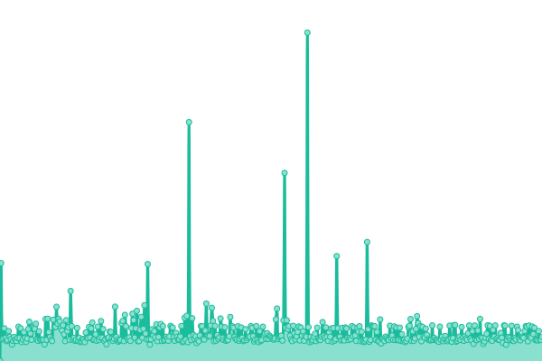

# [📈 Live Status](https://status.anydevcode.com): <!--live status--> **🟩 All systems operational**

This repository contains the open-source uptime monitor and status page for [Any Dev Code](https://anydevcode.com), powered by [Upptime](https://github.com/upptime/upptime).

With [Upptime](https://upptime.js.org), you can get your own unlimited and free uptime monitor and status page, powered entirely by a GitHub repository. We use [Issues](https://github.com/anydevcode/status.anydevcode.com/issues) as incident reports, [Actions](https://github.com/anydevcode/status.anydevcode.com/actions) as uptime monitors, and [Pages](https://status.anydevcode.com) for the status page.

<!--start: status pages-->
<!-- This summary is generated by Upptime (https://github.com/upptime/upptime) -->
<!-- Do not edit this manually, your changes will be overwritten -->
<!-- prettier-ignore -->
| URL | Status | History | Response Time | Uptime |
| --- | ------ | ------- | ------------- | ------ |
|  [Any Dev Code Website](https://anydevcode.com) | 🟩 Up | [any-dev-code-website.yml](https://github.com/AnyDevCode/status.anydevcode.com/commits/HEAD/history/any-dev-code-website.yml) | 

 164ms
     
 | 

<a href="https://status.anydevcode.com/history/any-dev-code-website">100.00%</a>
    

|  [Furry Bot Website](https://furry.anydevcode.com) | 🟩 Up | [furry-bot-website.yml](https://github.com/AnyDevCode/status.anydevcode.com/commits/HEAD/history/furry-bot-website.yml) | 

 164ms
     
 | 

<a href="https://status.anydevcode.com/history/furry-bot-website">100.00%</a>
    

|  [Bluey API](https://blueyapi.de) | 🟩 Up | [bluey-api.yml](https://github.com/AnyDevCode/status.anydevcode.com/commits/HEAD/history/bluey-api.yml) | 

 516ms
     
 | 

<a href="https://status.anydevcode.com/history/bluey-api">100.00%</a>
    

|  [Bluey Minecraft Server Java](mc.bluey.site) | 🟩 Up | [bluey-minecraft-server-java.yml](https://github.com/AnyDevCode/status.anydevcode.com/commits/HEAD/history/bluey-minecraft-server-java.yml) | 

 118ms
     
 | 

<a href="https://status.anydevcode.com/history/bluey-minecraft-server-java">94.20%</a>
    

<!--end: status pages-->

[**Visit our status website →**](https://status.anydevcode.com)

## 📄 License

- Powered by: [Upptime](https://github.com/upptime/upptime)
- Code: [MIT](./LICENSE) © [Anand Chowdhary](https://anandchowdhary.com), supported by [Pabio](https://pabio.com)
- Data in the `./history` directory: [Open Database License](https://opendatacommons.org/licenses/odbl/1-0/)
